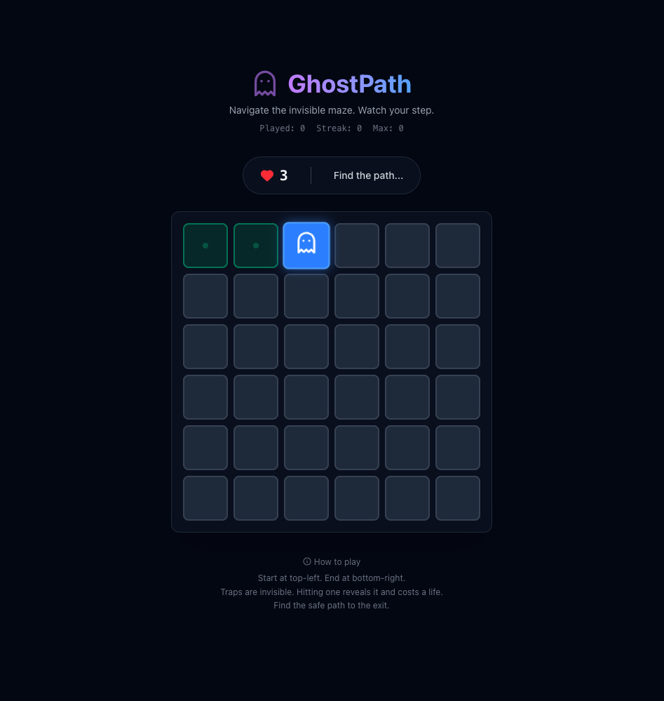

# GhostPath 👻

**GhostPath** is a daily puzzle game where you navigate an invisible maze.



## How to Play

- **Goal**: Navigate from the top-left to the bottom-right.
- **Mechanics**:
  - Click adjacent tiles to move.
  - **Traps are invisible**. Hitting one reveals it and costs a life.
  - You have **3 Lives**.
- **Daily Challenge**: Everyone gets the same grid every day (seeded by date).
- **Streaks**: Come back daily to build your streak!

## Features

- 🧩 **Daily Puzzle**: Unique grid generated every day.
- 💾 **Persistence**: Progress and stats saved automatically.
- 🔥 **Streaks**: Track your daily wins.
- 📱 **Responsive**: Works on mobile and desktop.
- 🎨 **Theme**: Sleek dark/neon aesthetic.

## Tech Stack

- **Framework**: React + Vite
- **Styling**: Tailwind CSS (v4)
- **Icons**: Lucide React
- **Runtime**: Bun

## Development

1. Install dependencies:

   ```bash
   bun install
   ```

2. Run dev server:

   ```bash
   bun run dev
   ```

3. Build for production:
   ```bash
   bun run build
   ```
